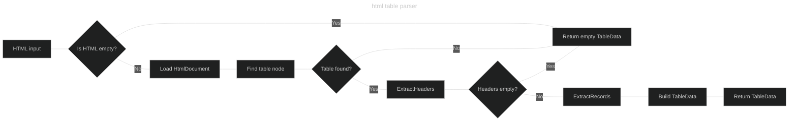

# html-data-extractor

[](https://github.com/Hakchi06/html-data-extractor/actions/workflows/ci.yml)


A generic C# library that transforms any HTML table into a 
structured `TableData` object.

---

## How it works

1. **Receive HTML** — the parser accepts any HTML string as input.

2. **Locate the table** — it searches for the first `<table>` element in the document. If none is found, it returns an empty result immediately.

3. **Extract headers** — reads each `<th>` inside the `<thead>` and builds the list of keys that every record will use. The table defines its own structure — the parser makes no assumptions.

4. **Extract records** — iterates over every `<tr>` inside the `<tbody>`. For each row, it maps each cell to its corresponding header by position, producing a `Dictionary<string, string>`.

5. **Resolve cell values** — for each cell, value extraction follows a priority order:
   - Visible text content
   - Image URL (`src` attribute) if no text is present
   - Link URL (`href` attribute) if no image is present

6. **Return `TableData`** — the result is a structured object containing the headers list, the list of records, and the total record count. Ready to serialize, filter, or pass to the next layer.

<details>
  <summary>View diagram</summary>
  

</details>

---

## Project structure

```
html-data-extractor/
├── src/
│   ├── HtmlDataExtractor.Core/        # Parsing logic
│   │   ├── Interfaces/
│   │   │   └── IHtmlParser.cs         # Parser contract
│   │   ├── Models/
│   │   │   └── TableData.cs           # Generic data model
│   │   └── Parsers/
│   │       └── HtmlTableParser.cs     # Core implementation
│   └── HtmlDataExtractor.Api/         # REST API (coming soon)
└── tests/
    └── HtmlDataExtractor.Tests/       # Unit tests
        └── TestData/                  # HTML samples for testing
```

---

## Usage

### Example input

<details>
<summary>View full HTML table</summary>
  
```html
<table id="dataTable">
  <thead>
    <tr>
      <th>Brand</th>
      <th>File Number</th>
      <th>Applicant</th>
      <th>Class</th>
      <th>Status</th>
    </tr>
  </thead>
  <tbody>
    <tr>
      <td>EXAMPLE BRAND</td>
      <td>123456</td>
      <td>EXAMPLE CORP S.A.</td>
      <td>32</td>
      <td>Registered</td>
    </tr>
  </tbody>
</table>
```
</details>

### Parse an HTML table

```csharp
using HtmlDataExtractor.Core.Parsers;
using System.Text.Json;

var parser = new HtmlTableParser();
var html = File.ReadAllText("your-table.html");

var result = parser.ParseTable(html);

var json = JsonSerializer.Serialize(result, new JsonSerializerOptions
{
    WriteIndented = true
});

Console.WriteLine(json);
```

### Example output

<details>
<summary>View full JSON response</summary>
  
```json
{
  "Headers": [
    "Brand",
    "File Number",
    "Applicant",
    "Class",
    "Status"
  ],
  "Records": [
    {
      "Brand": "EXAMPLE BRAND",
      "File Number": "123456",
      "Applicant": "EXAMPLE CORP S.A.",
      "Class": "32",
      "Status": "Registered"
    }
  ],
  "TotalRecords": 1
}
```
</details>

## Technical decisions

**Dynamic header extraction** — instead of defining a fixed model with hardcoded properties, the parser reads the table's own `<thead>` to determine the JSON keys. This makes the library reusable across any HTML table without modification.

## Disclaimer

This project was built for **educational purposes** as part of a personal learning journey with C# and .NET.

> [!IMPORTANT]
> This library only processes HTML strings that are provided as input. It does not perform HTTP requests, access external systems, or scrape any website.

The HTML samples used in tests were obtained manually from [DIGERPI](https://consultas.digerpi.gob.pa/wopublish-search/public/trademarks) — Panama's Intellectual Property Registry — solely to validate the parser against real-world HTML structures.
